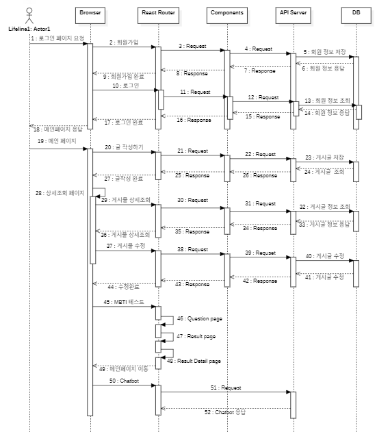

# MBTI_Book
✨ **React, MongoDB, Node.JS를 활용하여 제작한 mbti별 책 추천 웹서비스입니다!**

<br>

## 🗓  프로젝트 제작 기간 

<li> 2023.08.04 ~ 2023.08.15(12일)

## 📖 프로그램 설명

<!-- 프로그램설명 - 글 추가 작성 필요 -->
mbti가 많은 사람들에게 관심분야가 됐고 이와 접목시켜 이런 프로그램을 만들었다

## 💻 기술스택
<!-- 기술 스택 - 프론트엔드 영역 -->


 <br/>
<!-- 기술 스택 - 백엔드 영역 -->

<br>
<!-- 기술 스택 - 기타 기술 영역 -->


## 💻 실행 
```
> $ npm i 
> $ npm start
```
## 📚 구현한 기능

✅  mbti의 특징과 정보등을 위한 커뮤니티공간<br>
✅  로그인,회원가입 기능<br>
✅  12개의 질문을 통한 mbti와 mbti별 도서 추천 <br>
✅  다양한 추천 도서와 책 내용 소개 페이지 <br>
✅  mbti의 특징과 책 추천을 맡을 AI 챗봇<br>

## 📓웹서비스 이해를 위한 다이어그램<br>
<!-- 다이어그램 - 이미지 저장하면 집어넣을것! -->
<h3>유스케이스 다이어그램</h2>

.PNG)
<br>
<h3>시퀀스 다이어그램</h3>


